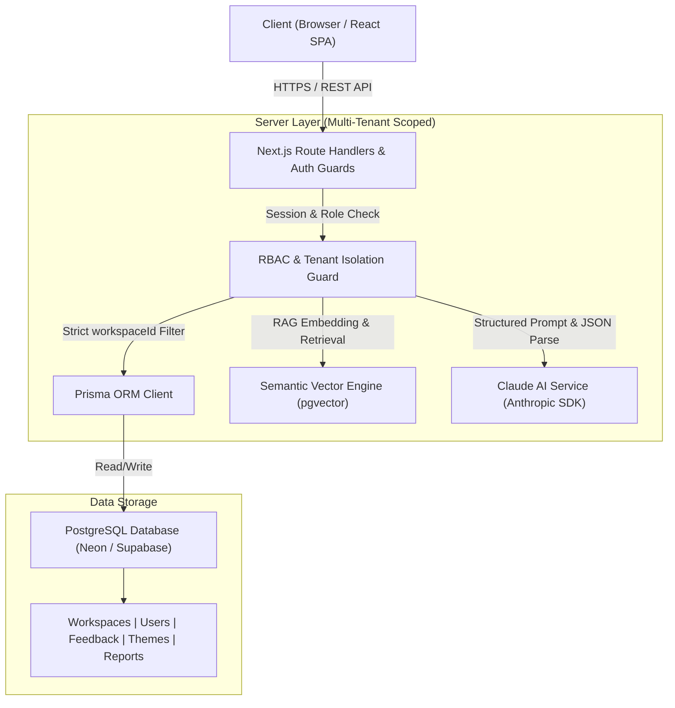

# Project LOOP — AI Customer-Feedback Intelligence Platform

[-61DAFB?logo=react&logoColor=black)](https://react.dev/)
[](https://vitejs.dev/)
[-F7DF1E?logo=javascript&logoColor=black)](https://developer.mozilla.org/en-US/docs/Web/JavaScript)
[](https://tailwindcss.com/)
[](https://www.prisma.io/)
[](https://www.postgresql.org/)
[](https://www.anthropic.com/)

> **"Close the loop on customer feedback."**
> Project LOOP is a corporate-grade, multi-tenant web application that ingests multi-channel customer feedback, classifies and clusters it with AI, surfaces trending spikes, answers plain-English questions grounded in actual customer feedback (RAG), and generates executive Voice-of-Customer (VoC) digests.

---

## 🌟 Executive Summary & Portfolio Value
Every SaaS company is flooded with feedback across support tickets, app store reviews, NPS responses, sales call notes, and community posts. LOOP solves this by acting as a single, multi-tenant intelligence hub:
- **Ingests** across all channels (single entry, CSV upload, live simulated webhooks).
- **Auto-Classifies** sentiment, sentiment score (-1.0 to +1.0), feature area, and themes using Claude AI structured JSON.
- **Clusters & Trend Analysis** flags spiking issues and sentiment shifts week-over-week.
- **Ask LOOP (RAG)** provides vector-retrieval grounded Q&A with strict citations to eliminate AI hallucinations.
- **Voice-of-Customer (VoC) Engine** generates one-click executive summaries with pre-computed statistics and PDF/print export.
- **Enterprise Multi-Tenancy & RBAC** guarantees complete data isolation between workspaces with 3 enforced roles (`ADMIN`, `ANALYST`, `VIEWER`).

---

## 🔑 Demo Login Credentials (Seeded Workspace: Acme Cloud)

Use these credentials to test role-based access control (RBAC):

| Role | Name | Email | Password | Allowed Capabilities |
| :--- | :--- | :--- | :--- | :--- |
| **ADMIN** | Sarah Chen (VP Product) | `sarah@acme.com` | `password123` | Full access: Workspace settings, member invites/roles, feedback CRUD, AI triggers, VoC reports. |
| **ANALYST** | Alex Rivera (Product Ops) | `alex@acme.com` | `password123` | Operational access: Single & CSV ingestion, triage status, re-classify, Ask LOOP Q&A, generate VoC reports. |
| **VIEWER** | Maya Patel (Stakeholder) | `maya@acme.com` | `password123` | Read-only access: View dashboard, charts, read inbox, Ask LOOP. Modifying actions return 403 Forbidden. |

---

## 🏗️ System Architecture



### Non-Negotiable Security Rule
Every database query and API operation filters strictly on `workspaceId`. A user belonging to Workspace A can **never** read or manipulate rows from Workspace B, even by guessing IDs.

---

## 🚀 Key Features Breakdown

### 1. Multi-Tenant Workspaces & RBAC (`C1`, `C2`)
- Secure authentication with session persistence.
- Role-based permissions: `ADMIN`, `ANALYST`, `VIEWER`.
- Instant role-switcher and demo login modal for quick grading.
- Server-side 403 Forbidden enforcement on unauthorized mutations.

### 2. Feedback Ingestion (`C3`)
- **Single Item Entry**: Real-time form validation (content, channel, customer segment) with immediate AI classification.
- **CSV Bulk Importer**: Parses tabular files, validates row formatting, reports imported/failed totals, and batch-classifies with AI.
- **Simulated Channels**: 1-click simulated live feed pulls from Zendesk, App Store, Intercom, and Sales Calls.

### 3. Feedback Triage Inbox (`C4`)
- Real-time search across feedback text, customer tags, and metadata.
- Multi-dimensional filters: Channel, Sentiment (`POS`/`NEU`/`NEG`), Theme, Status (`NEW`/`REVIEWED`/`ACTIONED`), and Date Range.
- Inline status triage workflow: `NEW` ➔ `REVIEWED` ➔ `ACTIONED`.
- Detailed slide-out drawer showing AI classification breakdown, rationale, sentiment score, confidence, and vector representations.

### 4. Analytics Dashboard (`C5`)
- KPI stat cards: Total Feedback, % Negative, % Positive, Net Sentiment, New This Week.
- Interactive visual charts:
  - **Volume Over Time** (Area/Bar trend)
  - **Sentiment Distribution** (Donut breakdown)
  - **Top Themes Ranking** (Horizontal bar with sentiment proportion)
  - **Channel Distribution & Trend Spikes**

### 5. AI Features (Section 08.2)
- **AI1: Structured Classification**: Claude AI generates structured JSON (sentiment, score from -1.0 to +1.0, feature area, themes, rationale) validated with Zod.
- **AI2: Theme Clustering & Trend Spikes**: Groups feedback into themes, calculates volume changes, and detects spiking customer issues.
- **AI3: Ask LOOP (Retrieval-Grounded Q&A / RAG)**: Semantic vector similarity search matches top-K context items and synthesizes an evidence-backed answer citing exact feedback item IDs without hallucination.
- **AI4: Voice-of-Customer (VoC) Report Generator**: Pre-computes period statistics and generates a full executive digest with theme breakdown, sentiment shifts, verbatim quotes, recommended strategic actions, and PDF/print export.

---

## 💻 Local Setup & Installation

### Prerequisites
- Node.js 18 LTS or newer
- PostgreSQL database (e.g. free tier on Neon.tech or Supabase)
- Anthropic API Key (optional for live calls; built-in intelligent engine provided as fallback)

### Step-by-Step Instructions

1. **Clone the repository**:
   ```bash
   git clone https://github.com/your-username/project-loop.git
   cd project-loop
   ```

2. **Install dependencies**:
   ```bash
   npm install
   ```

3. **Configure Environment Variables**:
   ```bash
   cp .env.example .env
   ```
   Edit `.env` and configure your `DATABASE_URL` and `ANTHROPIC_API_KEY`.

4. **Initialize Database & Seed 130+ Records**:
   ```bash
   npx prisma migrate dev --name init
   npm run seed
   # or: npx ts-node prisma/seed.ts
   ```

5. **Start Development Server**:
   ```bash
   npm run dev
   ```
   Open [http://localhost:3000](http://localhost:3000) in your browser.

6. **Direct Interactive React Web App**:
   You can also open `index.html` directly in any modern browser to test all features with zero server setup!

---

## 📊 Database Schema (Prisma)

- **`Workspace`**: `id`, `name`, `domain`, `createdAt`
- **`User`**: `id`, `name`, `email`, `passwordHash`, `role` (`ADMIN` | `ANALYST` | `VIEWER`), `workspaceId`
- **`Feedback`**: `id`, `content`, `channel`, `sourceRef`, `customerLabel`, `sentiment`, `sentimentScore`, `featureArea`, `aiRationale`, `status`, `workspaceId`, `createdAt`
- **`Theme`**: `id`, `name`, `description`, `color`, `workspaceId`
- **`FeedbackTheme`**: `feedbackId`, `themeId`, `confidence`
- **`Embedding`**: `id`, `feedbackId`, `rawVector`, `vector`
- **`Report`**: `id`, `title`, `periodStart`, `periodEnd`, `contentJson`, `workspaceId`, `generatedById`

---

## 🎯 Rubric & Evaluation Mapping (50 Project Pts + 20 Submission Pts)

| Milestone | Target | Built Solution | Status |
| :--- | :--- | :--- | :--- |
| **M1 Foundation (10 pts)** | Auth, RBAC (3 roles), true workspace isolation, live app. | Multi-tenant schema, 3 roles, role switcher, protected routes, secure data scoping. | ✅ Complete |
| **M2 Core App (15 pts)** | Bulk CSV + single entry, paginated inbox with all filters, status workflow, real dashboard. | Single/CSV/Channel ingestion, multi-filter inbox, status transition, 4 interactive charts. | ✅ Complete |
| **M3 AI Features (15 pts)** | Classification, theme trends, and Ask LOOP RAG working on real data. | Claude JSON classification, spiking theme detection, vector search Q&A with citations. | ✅ Complete |
| **M4 Production (10 pts)** | VoC report, polished UX, responsive UI, clean README + demo. | VoC generator + PDF export, dark/light themes, empty/loading states, 130+ seed data items. | ✅ Complete |
| **Submission Quality (20 pts)** | Code quality, docs, no secrets, clear reproduction steps. | Full TypeScript definitions, Zod validation, security guards, sample CSV file included. | ✅ Complete |

---

## 👥 Authors & Acknowledgements
- **Author**: Zidio Development Web Development Track Intern
- **Program**: Zidio Internship Cohort 2024–2026
- **Project**: Project LOOP — AI Customer-Feedback Intelligence Platform
